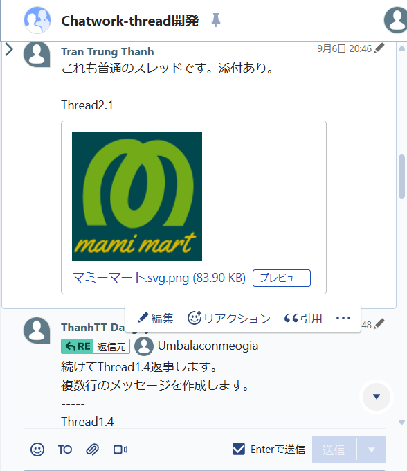
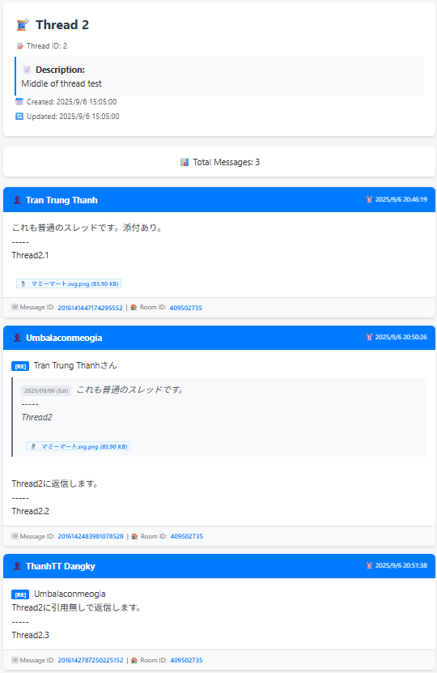

# Chatwork thread

Chatwork không có tính năng hiển thị các nội dung chat có liên quan theo thread. Trong một group chat, dù có nhiều nội dung khác nhau thì chúng được hiển thị theo thời gian gửi lên, không phân theo thread khiến việc truy đọc nội dung liên quan trở nên khó khăn. Và không có cách nào (ví dụ như plugin, tool) để hiển thị nội dung theo thread cả.

Chương trình này được viết ra với mục đích muốn hiển thị nội dung chat có liên quan theo thread để dễ theo dõi.

Ví dụ output (theo format html).
 &nbsp;&nbsp;&nbsp; &rArr; &nbsp;&nbsp;&nbsp; 


## Quick Start

### Prerequisites
- Node.js v18+, npm, Chatwork API Token

### Setup
```bash
git clone https://github.com/your-username/chatwork-thread.git
cd chatwork-thread
npm install
cp env.example .env  # Edit .env with your Chatwork API token
npm run build
node dist/cli/chatwork-thread.js migrate  # Setup database
```

## Basic Commands

### Database Migration
```bash
node dist/cli/chatwork-thread.js migrate        # Run migrations
node dist/cli/chatwork-thread.js migrate --check # Check status
```

### Thread Operations
```bash
# Create thread from message
node dist/cli/chatwork-thread.js create <message-id> --name "Thread Name"

# List threads
node dist/cli/chatwork-thread.js list

# Show thread content
node dist/cli/chatwork-thread.js show <thread-id>

# Export to HTML
node dist/cli/chatwork-thread.js show <thread-id> --format html --output thread.html

# Refresh thread to get latest messages
node dist/cli/chatwork-thread.js refresh <thread-id>
```

### Fetch all messages in a room
`fetch-room` lấy toàn bộ message trong room (tự phân trang và giữ rate limit), lưu vào database. **Không tạo thread** (chỉ cập nhật bảng messages). Tên room từ Chatwork được lưu vào bảng `chatwork_rooms` để dùng khi tạo thread từ room.

```bash
# Lấy toàn bộ room (phân trang + rate limit tự động), lưu DB
node dist/cli/chatwork-thread.js fetch-room <room-id>

# Chỉ 1 request API (room ít message hoặc kiểm tra nhanh)
node dist/cli/chatwork-thread.js fetch-room <room-id> --single

# Chỉ fetch và in số lượng, không lưu
node dist/cli/chatwork-thread.js fetch-room <room-id> --no-save
```

### Xuất toàn bộ room như một thread
Sau khi đã `fetch-room`, tạo một thread chứa toàn bộ message trong room rồi dùng `show` để xem/xuất:

```bash
# 1. Lấy message trong room (nếu chưa có)
node dist/cli/chatwork-thread.js fetch-room <room-id>

# 2. Tạo thread từ toàn bộ room (không chỉ định --name thì dùng tên room từ Chatwork)
node dist/cli/chatwork-thread.js create-from-room <room-id>

# 3. Xem hoặc xuất (text / json / markdown / html)
node dist/cli/chatwork-thread.js show <thread-id> --format html --output room.html
```

## Documentation

- **[Complete Command Reference](docs/commands.md)** - Detailed documentation cho tất cả CLI commands
- **[System Design](docs/SystemDesign/)** - Architecture và design documents
- **[Development Guide](docs/dev/)** - Development workflow và best practices

## Features

HTML export với clickable links, file attachments, auto-linking URLs, và modern responsive design.